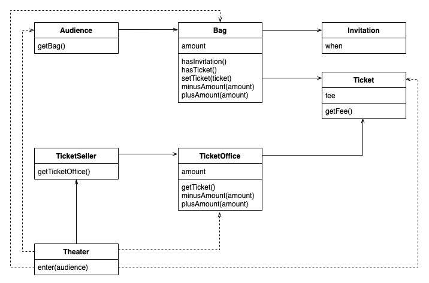
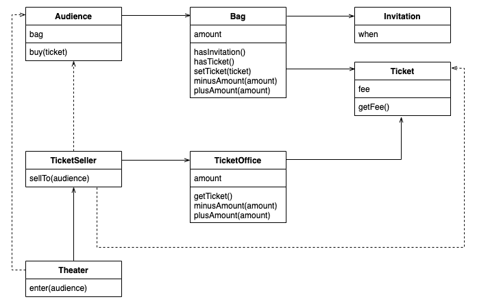

# 이론이 먼저일까, 실무가 먼저일까?
* 실무가 어느 정도 발전하고 난 다음에야 비로소 실무의 실용성을 입증할 수 있는 이론이 갖춰지기 시작.
* 건축처럼 역사가 오래된 여느 다른 공학 분야에 비해 상대적으로 짧은 소트프웨어 분야.
* 현재 상태로는 **이론보다 실무가 먼저.** (로버트 L. 글래스)
* 빠르게 구현/수정을 반복하며 진행하는 방식이 애자일과 유사.

# 소프트웨어 모듈이 가져야 하는 세 가지 기능 (Robert C. Martin)
1. *실행 중에 제대로 동작하는 것* -> 모듈의 존재 이유
2. *변경을 위해 존재하는 것* -> 간단한 작업만으로도 변경이 가능해야 함
3. *코드를 읽는 사람과 의사소통하는 것* -> 쉽게 읽고 이해할 수 있어야 함

# 기존 구조
  

## 빗나가는 예상
* Theater가 다른 객체들의 여러가지 세부적인 내용을 기억하고 있어야 한다.
  * 관람객이 가방을 가지고 있다.
  * 가방 안에는 초대장, 티켓, 현금이 있다.
  * 별도의 승인절차 없이도 접근과 사용이 가능하다.
* 이해 가능한 코드란, 그 동작이 우리의 예상에서 크게 벗어나지 않는 코드다. -> **일상생활에서 쉽게 경험하고 느낄 수 있는 것들.**
  * 극장이 멋대로 내 가방을 뒤져서 티켓팅을 한다면 이해 하겠는가?
## 변경에 취약
* 관람객이 현금과 초대장을 보관하기 위해 **항상 가방을 들고 다닌다고 가정**한다.
  * 가방이 없는 관람객일 경우?
  * 현금이 없고 카드만 있을 경우?
* 판매원이 **매표소에서만 티켓을 판매한다고 가정**한다.
  * 매표소 밖에서 티켓을 판매해야 할 경우?
* 객체간의 의존성이 높다.
  * 다른 객체들을 변경할 때, Theater를 같이 변경해야 하는 상황이 많다.
  * 의존성이라는 말 속에는 어떤 객체가 변경될 때 그 객체에게 의존하는 다른 객체도 함께 변경될 수 있다는 사실이 내포돼 있다.
  * 객체 사이의 의존성이 과한 경우를 가리켜 결합도(coupling)가 높다고 말한다.

# 개선된 구조

## 자율성 향상
* 극장(Theater)이 관람객(Audience)과 판매원(TicketSeller)에 관해 너무 세세한 부분까지 알 필요가 없다.
  * 우리가 살고 있는 현실 세계를 생각해보자.
  * 극장, 혹은 판매원 입장에서 생각해 볼 때, 관람객이 가방과 현금을 갖고 있는지 알고 있어야 할까?
  * ~~현금결제 유도를 위해 물어보는 경우는 있을 수 있겠다.~~
* 자기의 일은 스스로 하자. (책임의 이동)
  * 현실 세계의 직장인 들도 자기가 맡은 역할과 책임 내에서 스스로 일을 한다. (스스로 자신의 데이터를 책임저야 한다.)
  * 업무요청 시 처리자가 그 업무를 세부적으로 어떻게 처리할 것인지 알 필요가 없다.
  * 관람객이 할 일은 관람객이, 판매원이 할 일은 판매원이 한다.
* 의존성과 결합도를 낮추다.
  * 설계를 어렵게 만드는 것은 의존성. 불필요한 의존성을 제거함으로써 객체 사이의 결합도를 낮춘다.
  * 결합도를 낮추기 위해 캡슐화를 사용.
    * 개념적이나 물리적으로 객체 내부의 세부적인 사항을 감추는 것을 캡슐화(encapsulation)라고 부른다.
    * 캡슐화의 목적은 변경하기 쉬운 객체를 만드는 것.
  * 밀접하게 연관된 작업만을 수행하고 연관성 없는 작업은 다른 객체에게 위임하는 객체를 가리켜 **응집도(cohesion)**가 높다고 말한다.

# 절차지향과 객체지향
## 절차지향
* 프로세스와 데이터를 **별도의 모듈에** 위치
## 객체지향
* 프로세스와 데이터를 **동일한 모듈 내부에** 위치 (역할과 책임이 적절하게 적용된 모듈로 구성)

# 객체지향의 설계
* 설계를 구현과 떨어뜨려서 이야기 하는 것은 불가능.
* 설계는 코드 작성의 일부이며, 코드를 작성하지 않고서는 검즐할 수 없다.
* 변경을 수용할 수 있는 설계는 매우 중요하다.
  * 요구사항은 항상 변경되기 때문
  * 코드를 변경할 때 버그가 추가될 가능성이 높기 때문
* 훌륭한 객체지향 설계란 협력하는 객체 사이의 의존성을 적절하게 관리하는 것.

# 의인화
* 비록 현실에서는 수동적인 존재라고 하더라도 일단 객체지향의 세계에 들어오면 모든 것이 능동적이고 자율적인 존재로 바뀐다.
  * 위에서 얘기한 극장과 가방은 실세계에서 자율적인 존재인가?
* 능동적이고 자율적인 존재로 소프트웨어 객체를 설계하는 원칙을 가리켜 **의인화(anthropomorphism)**라고 부른다.

# 트레이드 오프
* 정답은 없다.
  1. 어떤 기능을 설게하는 방법은 한가지 이상일 수 있다.
  2. 동일한 기능이 한 가지 이상의 방법으로 설계할 수 있기 때문에 결국 설계는 트레이드 오프의 산물이다.
* 설계는 균형의 예술. 훌륭한 설계는 적절한 트레이드 오프의 결과물.
