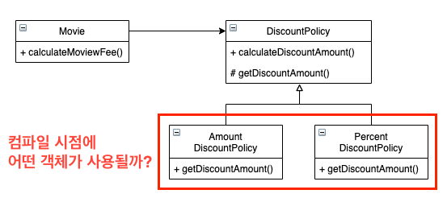

> ### 기술적인 글을 쓸 때 가장 어려운 부분은 **적당한 수준의 난이도와 복잡도를 유지하면서도 이해하기 쉬운 예제를 선택하는 것**이다.
> ...적당히 어렵지만 어렵지 않게 하라..? ~~시작부터 좋지 않다~~

## 2.1. 영화예매 시스템
### 요구사항 살펴보기
* 말 그대로 예제의 요구사항을 명시. ~~그냥 책 보자.~~

## 2.2. 객체지향 프로그래밍을 향해
### 협력, 객체, 클래스
* 객체지향은 **객체**를 **지향**하는 것. ~~내가 뭘 본거지?~~
* 진정한 객체지향 패러다임으로의 전환은 클래스가 아닌 객체에 초점을 맞출 때에만 얻을 수 있다.
* 어떤 클래스가 필요한지를 고민하기 전에 어떤 객체들이 필요한지 고민하라.
  * 이미 추상화를 거친 **클래스**를 먼저 생각하면 안된다.
  * 현실 세계에 존재하는 것을 **객체화** 하여 어떤 상태와 행동을 가지는지 생각하라.
* 객체를 독립적인 존재가 아니라 기능을 구현하기 위해 협력하는 공동체의 일원으로 봐야 한다.
  * 다른 객체에게 도움을 주거나 의존하면서 살아가는 협력적인 존재.
  * 협력. 협력. 협력.
* 객체란 식별 가능한 개체 또는 사물이다. [객체지향의 사실과 오해]
### 도메인의 구조를 따르는 프로그램 구조
* 문제를 해결하기 위해 사용자가 프로그램을 사용하는 **분야**를 도메인이라고 부른다.
* 객체지향 패러다임이 강력한 이유는 요구사항을 분석하는 초기 단계부터 프로그램을 구현하는 마지막 단계까지 **객체라는 동일한 추상화 기법**을 사용하기 때문이다.
* 일반적으로 클래스의 이름은 대응되는 도메인 개념의 이름과 동일하거나 적어도 유사하게 지어야 한다.
* 클래스 사이의 관계도 최대한 도메인 개념 사이에 맺어진 관계와 유사하게 만들어서 프로그램의 구조를 이해하고 예상하기 쉽게 만들어야 한다.
  * 현실 세계에서 일반적으로 생각할 수 있는 관계를 생각하라.   
    ex) 극장에는 관객이 있을 것이고, 그 관객은 티켓을 가지고 있을 수도, 없을 수도 있다.

### 클래스 구현하기
* 가장 중요한 것은 **클래스의 경계를 구분 짓는 것**.
* 경계의 명확성이 **객체의 자율성을 보장**하고 프로그래머에게 **구현의 자유를 제공**.
  * 의존성을 최소화
#### 자율적인 객체
* 객체란?
  * 상태(state)와 행동(behavior)을 함께 가지는 **복합적인 존재**.
  * 스스로 판단하고 행동하는 **자율적인 존재**. 
* 자율적인 존재로 만들기 위해 객체 내부에 대한 접근을 통제.
* 캡슐화와 접근 제어는 객체를 두 부분으로 나눈다.
  * 외부에서 접근 가능한 퍼블릭 인터페이스(public interface)
  * 오직 내부에서만 접근 가능한 구현(implementation)
  * 
#### 프로그래머의 자유
* 프로그래머의 역할
  * 클래스 작성자(class creator) : 새로운 데이터 타입을 프로그램에 추가
  * 클라이언트 프로그래머(client programmer) : 클래스 작성자가 추가한 데이터 타입을 사용
* 구현 은닉(implementation hiding)의 장점
  * *클래스 작성자*는 클라이언트 프로그래머에 대한 영향을 걱정하지 않고 내부 구현을 변경 가능
  * *클라이언트 프로그래머*는 인터페이스만 사용하기 때문에 복잡한 내부구현은 신경쓰지 않아도 문제 없음
* **접근 제어**는 객체의 변경을 관리할 수 있는 가장 대표적인 기법.
  * public 접근제한자를 사용할 때는 다시 한번 더 생각하라. **정말 외부에 공개가 되어야 하는가?**

### 협력하는 객체들의 공동체
* 의미를 좀 더 명시적이고 분명하게 표현할 수 있다면 객체를 사용하라.   
  ex) 금액을 Long이 아닌 Money로 구현하여 명시적인 의미를 전달하고 관련 로직을 담당.
* 개념을 명시적으로 표현하는 것은 전체적인 설계의 명확성과 유연성을 높이는 첫걸음.

### 협력에 관한 짧은 이야기
* 메시지(message)와 메서드(method)를 구분하는 것은 매우 중요.
  * 메시지 : 객체가 다른 객체와 상호작용할 수 있는 수단
  * 메서드 : 수신된 메시지를 처리하기 위한 자신만의 방법

## 2.3 할인 요금 구하기
### 할인 요금 계산을 위한 협력 시작하기
* (코드 설명이 대부분)
### 할인 정책과 할인 조건
* TEMPLATE METHOD 패턴
  * 부모 클래스에 기본적인 알고리즘의 흐름을 구현하고 중간에 필요한 처리를 자식 클래스에 위임하는 디자인 패턴
### 할인 정책 구성하기
* 생성자의 파라미터 목록을 이용해 초기화에 필요한 정보를 전달하도록 강제하면 올바른 상태를 가진 객체의 생성을 보장할 수 있다. 

## 2.4 상속과 다형성
### 컴파일 시간 의존성과 실행 시간 의존성
* 의존성이 존재한다는 것은?
  * 어떤 클래스가 다른 클래스에 접근할 수 있는 경로를 가짐
  * 해당 클래스의 객체의 메서드를 호출
* 코드의 의존성과 실행 시점의 의존성은 서로 다를 수 있다. 어떤 객체를 사용할지 실행 시점에 선택 가능!
  * 유연하고 재사용성과 확장 가능성이 높음
  * 코드를 이해하고 디버깅 하기 어려움
  * 의존성의 양면성은 설계가 트레이드오프의 산물
* 

### 차이에 의한 프로그래밍
* 상속이란?
  * 두 클래스 사이의 관계를 정의하는 방법
  * 객체지향에서 코드를 재사용하기 위해 가장 널리 사용되는 방법
* 차이에 대한 프로그래밍(programming by difference)
  * 부모 클래스와 다른 부분만을 추가해서 새로운 클래스를 쉽고 빠르게 만드는 방법

### 상속과 인터페이스
* 상속이 가치 있는 이유
  * 부모 클래스가 제공하는 모든 인터페이스를 자식 클래스가 물려받을 수 있다.
  * 동일한 인터페이스를 공유하는 클래스들을 하나의 타입 계층으로 묶을 수 있다.
* 인터페이스는 객체가 이해할 수 있는 메시지의 목록을 정의
* 자식 클래스는 상속을 통해 부모 클래스의 인터페이스를 물려받기 때문에 **부모 클래스 대신 사용될 수 있다.**
  
* 업캐스팅
  * 자식 클래스가 부모 클래스를 대신하는 것
    * 위 그림에서는 AmountDiscountPolicy, PercentDiscountPolicy가 DiscountPolicy를 대신할 수 있다.
* 다형성
  * 동일한 메시지를 수신했을 때 객체의 타입에 따라 다르에 응답할 수 있는 능력.
  * **컴파일 시간 의존성**과 **실행 시간 의존성**이 다를 수 있다는 사실을 기반으로 한다.
* 바인딩의 종류
  * *메시지와 메서드를 ...*
    * 실행 시점에 바인딩 => 지연 바인딩(lazy binding) or 동적 바인딩(dynamic binding)
    * 컴파일 시점에 바인딩 => 초기 바인딩(early binding) or 정적 바인딩(static binding)
* 상속의 종류
  * 구현 상속(implementation inheritance)
    * 순수하게 코드를 재송하기 위한 목적.
    * 변경에 취약판 코드를 낳게 될 확률이 높다.
  * 인터페이스 상속(interface inheritance)
    * 부모 클래스와 자식 클래스가 인터페이스를 공유할 수 있도록 상속을 이용하는 것.

### 인터페이스와 다형성
* 인터페이스
  * 구현에 대한 고려 없이 다형적인 협력에 참여하는 클래스들이 공유 가능한 외부 인터페이스를 정의한 것.

## 2.5 추상화와 유연성
### 추상화의 힘
* 추상화의 장점
  * 요구사항의 정책을 높은 수준에서 서술할 수 있음.
    * 
    * 세부적인 내용을 무시한 채 상위 정책을 쉽고 간단하게 표현 가능.
    * 상위 개념만으로도 도메인의 중요한 개념을 설명 가능.
  * 설계가 유연해짐.
    * 기존 구조의 수정 없이 새로운 기능을 쉽게 추가 가능.

### 유연한 설계
* 추상화가 유연한 설계를 가능하게 하는 이유.
  * 설계가 구체적인 상황에 결합되는 것을 방지.
* 유연성이 필요한 곳에 추상화를 사용.

### 추상 클래스와 인터페이스 트레이드오프
* 개선전
  
* 개선 후
  

### 코드 재사용
* 상속은 코드를 재사용하기 위해 널리 사용되는 방법.
* 코드 재사용을 위해서는 합성(composition)이 더 좋은 방법이다.
* 합성
  * 다른 객체의 인스턴스를 자신의 인스턴스 변수로 포함해서 재사용하는 방법.

### 상속
* 객체지향에서 코드를 재사용하기 위해 널리 사용되는 기법
* 단점
  * 캡슐화 위반.
    * 부모 클래스의 내부 구조를 잘 알고 있어야 한다.
    * 부모 클래스와 자식 클래스가 **강하게 결합된다.**
  * 설계를 유연하지 못하게 함.
    * 상속은 부모 클래스와 자식 클래스 사이의 **관계를 컴파일 실점에 결정**한다.
    * 사용중인 클래스의 **상태**를 변경할 클래스에 복사해야 한다.
    * 상속은 부모객체가 **상태**를 갖고 있기 때문.
    ```
    Movie avatar = new Movie("아바타",
        Duration.ofMinutes(120),
        Money.wons(10_000),
        new AmountDiscountPolicy(Money.wons(800), ...));
    
    // interface인 경우 구현체만 변경하면 된다.
    avatar.changeDiscountPolicy(new PercentDiscountPolicy(0.1, ...));
    ```

### 합성
* 인터페이스에 정의된 메시지를 통해서만 코드를 재사용하는 방법.
* 장점 (상속대비)
  * 구현을 효과적으로 캡슐화 가능.
  * 설계를 유연하게 만듦.
* 코드 재사용을 위해서는 상속보다는 합성을 선호하는 것이 좋은 방법.
