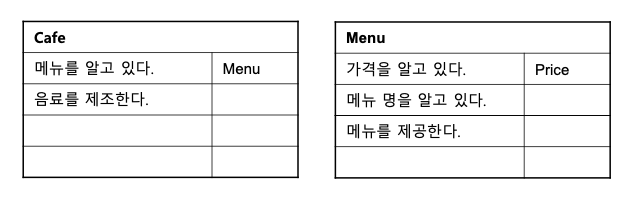

> ### 객체지향 패러다임의 관점에서 핵심은 역할(role), 책임(responsibility), 협력(collaboration)이다.
> ### 객체지향의 본질은 협력하는 객체들의 공동체를 창조하는 것.

## 3.1 협력
### 영화 예매 시스템 돌아보기
* 기능을 구현하기 위해 메시지를 주고받으면서 상호작용.
* *협력* : 객체들이 애플리케이션의 기능을 구현하기 위해 수행하는 상호작용
* *책임* : 객체가 협력에 참여하기 위해 수행하는 로직
* *역할* : 객체들이 협력 안에서 수행하는 책임들의 모임
* 책임과 역할은 1:N 관계.

### 협력
* 어떤 객체가 다른 객체에가 무언가를 요청하는 것.
* 객체 사이의 협력을 설계할 때는 서로 분리된 인스턴스가 아닌 협력하는 파트너로 인식해야 한다.
* *메시지 전송* : 객체 사이의 협력을 위해 사용할 수 있는 유일한 커뮤니케이션 수단.
* 메시지를 수신한 객체는 **스스로 메서드를 선택하고 실행하여 요청에 응답**하고 
* 자율적인 객체란 **자신의 상태를 직접 관리**하고 **스스로의 결정에 따라 행동**하는 객체.
* 자신이 할 수 없는 일은 다른 객체에게 위임!

### 협력이 설계를 위한 문맥을 결정한다
* **어떤 객체도 섬이 아니다.** (섬 : 협력이 없는 존재.)
* 애플리케이션 안에 어떤 객체가 필요하다면 그 이유는 단 하나여야 한다.
* 객체가 협력에 참여할 수 잇는 이유는 협력에 필요한 적절한 행동을 보유하고 있기 때문.
* 객체의 *행동*을 결정하는 것이 **협력**이라면 객체의 *상태*를 결정하는 것은 **행동**이다.
* 객체의 상태는 그 객체가 행동을 수행하는 데 필요한 정보가 무엇인지로 결정된다.
  * 객체를 설계할 때 상태보다 **행동**을 먼저 생각해야 하는 이유.
* **상태**는 *객체가 행동하는 데 필요한 정보에 의해 결정*되고 **행동**은 *협력 안에서 객체가 처리할 메시지로 결정*된다.
* 협력은 객체를 설계하는 데 필요한 일종의 **문맥(context)**을 제공.

## 3.2 책임

### 책임이란 무엇인가
* 협력에 참여하기 위해 객체가 수행하는 행동.
* 객체에 의해 정의되는 응집도 있는 행위의 집합.
* 객체의 책임은 객체가 **'무엇을 알고 있는가'**(아는 것)와 **'무엇을 할 수 있는가'**(하는 것)로 구성된다.
  * 하는 것(doing)
    * 객체를 생성하거나 계산을 수행하는 등의 스스로 하는 것
    * 다른 객체의 행동을 시작시키는 것
    * 다른 객체의 활동을 제어하고 조절하는 것
  * 아는 것(knowing)
    * 사적인 정보에 관해 아는 것
    * 관련된 객체에 관해 아는 것 (내가 할 수 없다. 그러나 다른 객체는 할 수 있다.)
    * 자신이 유도하거나 계산할 수 있는 것에 관해 아는 것
* 협력 안에서 객체에게 할당한 책임이 외부의 인터페이스와 내부의 속성을 결정.
* 객체지향 개발에서 가장 중요한 능력은 **책임을 능숙하게 소프트웨어 객체에 할당하는 것.**
* CRC 카드
  * 후보(**C**andidate), 책임(**R**esponsibility), 협력자(**C**ollaborator)
  * 객체를 쉽고 명확하게 표현할 수 있는 기법.
  * 효과적으로 일하는 사람들은 추상적이로 가상적인 것보다는 **구체적이고 실재적인 것을 사용하는 경향이 있다**고 설명한다.
  * 

### 책임 할당
* 책임 할당을 위한 INFORMATION EXPERT(정보 전문가) 패턴
  * 책임을 수행하는 데 필요한 정보를 가장 잘 알고 있는 전문가에게 그 책임을 할당하는 것.
* 정보 전문가에게 책임을 할당하는 것은 일상 생활에서 도움을 요청하는 방식과도 유사.
* 객체에게 책임을 할당하기 위해서는 먼저 협력이라는 문백에 대한 정의가 필요.
  * 어떤 협력이 이루어져야 하는가?
* 협력을 설계하면서 최종적으로 얻게 되는 결과물은 **시스템을 구성하는 객체들의 인터페이스와 오퍼레이션의 목록.**
* 상태와 행동을 함께 가지는 자율적인 객체를 만들 수 있는 가능성이 높아진다.

### 책임 주도 설계
* 책임 주도 설계(**R**esponsibility-**D**riven **D**esign, RDD)
  * 책임을 갖고 책임을 수행할 적절한 객체를 찾아 책임을 할당하는 방식으로 협력을 설계하는 방법.
* 설계 과정
  1. 시스템이 사용자에게 제공해야 하는 기능인 시스템 책임을 파악한다.
  2. 시스템 책임을 더 작은 책임으로 분할한다.
  3. 분할된 책임을 수행할 수 있는 적절한 객체 또는 역할을 찾아 책임을 할당한다. 
  4. 객체가 책임을 수행하는 도중 다른 객체의 도움이 필요한 경우 이를 책임질 적절한 객체 또는 역할을 찾는다.
  5. 해당 객체 또는 역할에게 책임을 할당함으로써 두 객체가 협력하게 한다.
* 책임할 할당할 때 고려해야 하는 두가지 요소
  * **메시지**가 **객체**를 결정.
  * **행동**이 **상태**를 결정.

### 메시지가 객체를 결정한다
* 객체가 메시지를 선택하는 것이 아니라 **메시지가 객체를 선택하게 했다.**
* 메시지가 객체를 선택하게 해야 하는 두 가지 중요한 이유
  1. 객체가 최소한의 인터페이스(minimal interface)를 가질 수 있게 된다.
  2. 객체는 충분히 추상적인 인터페이스(abstract interface)를 가질 수 있게 된다.
    * 객체의 인터페이스는 무엇(what)을 하는지 표현해야 하지만 어떻게(how) 수행하는지는 노출해서는 안 된다.

### 행동이 상태를 결정한다
* 객체의 행동은 객체가 협력에 참여할 수 있는 유일한 방법.
* 객체가 협력에 적합한지를 결정하는 것은 그 객체의 상태가 아니라 행동.
* 사람들이 가장 쉽게 빠지는 실수는 행동이 아니라 상태에 초점을 맞추는 것.
  * **행동이 먼저 정해라. 상태는 자연스럽게 따라온다.**
  * 상태는 단지 객체가 행동을 정상적으로 수행하기 위해 필요한 재료일 뿐이다.

## 3.3 역할
### 역할과 협력
* 객체가 어떤 특정한 협력 안에서 수행하는 책임의 집합.
  * 역할:책임 = 1:N
### 유연하고 재사용 가능한 협력
* 역할이 중요한 이유는 역할을 통해 유연하고 재사용 가능한 협력을 얻을 수 있기 떄문.
  * ~~비슷한 문장을 상당히 많이 본 듯 하다. 착각인가?~~
* 프로그래밍에서 **코드 중복은 모.든. 문.제.의. 근.원.**
* 역할을 이용하면 중복 코드를 제거할 수 있고 협력을 더 유연하게 할 수 있다.
* 역할의 구현
  * 역할을 구현하는 가장 일반적인 방법은 **추상 클래스**와 **인터페이스**를 사용하는 것.
    * 추상 클래스 : 책임의 일부를 구현해 놓은 것.
    * 인터페이스 : 일체의 구현 없이 책임의 집합만을 나열해 놓은 것.

### 객체 대 역할
* 역할은 객체가 참여할 수 있는 일종의 슬롯.
  * 슬롯이기 때문에 동일한 유형의 다른 것으로 대체가 가능하다!
  * 220v 콘센트 역시 슬롯일까?
* 객체에 관해 생각할 때 **이 객체가 무슨 역할을 수행해야 하는가**라고 자문하는 것이 도움이 된다.
  * 개인적으로는, 도움이 아니라 **필수 선행과정**이라고 생각한다.
* 설계 초반에는 역할과 객체를 명확하게 구분하는 것은 그렇게 중요하지는 않다?
  * 애매하다면, 객체로 시작해서 반복적으로 책임과 협력을 정제해가면서 필요한 순간에 객체로부터 역할을 분리해 내자.
* 다양한 객체들이 협력에 참여한다는 것이 확실하다면 역할로 시작하라.
  * 협력에 참여한다는 것이 확실하지 않다면, 그것은 객체라고 할 수 있는가?

### 역할과 추상화
* 세부사항에 억눌리지 않고도 상위 수준의 정책을 쉽고 간단하게 표현할 수 있다.
  * 객체에게 중요한 것은 행동.
  * 역할이 중요한 이유는 동일한 협력을 수행하는 객체들을 추상화 할 수 있기 때문.
    * ex) 비율할인정책, 고정할인정책은 **할인정책**이라는 것으로 추상화가 가능하다.
* 설계를 유연하게 만들 수 있다.
  * 역할은 다양한 종류의 객체를 끼워넣을 수 있는 슬롯.
  * 상황에 따라 유연하게 변경이 가능하다.

### 배우와 배역
* 배우와 배역 간의 특성
  * 배역은 연극 배우가 특정 연극에서 연기하는 역할이다.
  * 배역은 연극이 상영되는 동안에만 존재하는 일시적인 개념이다.
  * 연극이 끝나면 연극 배우는 배역이라는 역할을 벗어 버리고 원래의 연극 배우로 돌아온다.
*  훌륭한 은유.
* 협력이라는 문맥 안에서 역할은 특정한 협력에 참여해서 책임을 수행하는 객체의 일부.
* 역할은 모양이나 구조에 의해 정의될 수 없으며 오직 시스템의 문맥 안에서 무엇을 하는지에 의해서만 정의될 수 있다.
* **객체**는 특정한 **협력** 안에서는 일시적으로 오직 하나의 **역할**만이 보여진다.
  * **배우**가 하나의 **연극**에서 오직 하나의 **배역**을 연기하는 것.
  * **simba라는 배우**는 **로미오와 줄리엣의 한 장면**에서 **로미오와 줄리엣 2개의 배역**을 연기할 수 있는가?
ㅇ