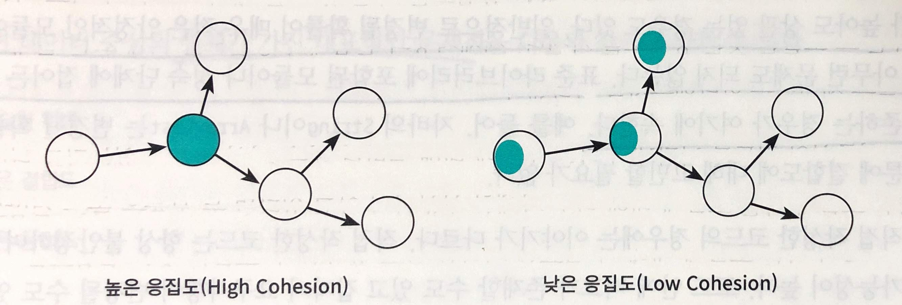
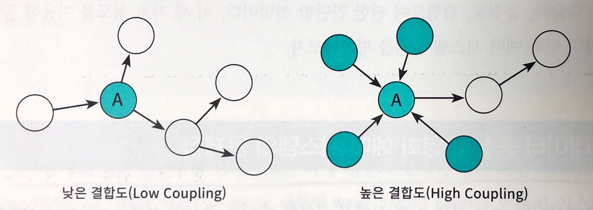

# 설계 품질과 트레이드오프

* 객체지향 설계의 핵심은 역할, 책임, 협력.
* 그 중 가장 중요한 것은 **책임**.
* 설계는 변경을 위해 존재하고 변경에는 어떤 식으로는 비용이 발생한다.
* 훌륭한 설계란 합리적인 비용 안에서 변경을 수용할 수 있는 구조를 만드는 것.
* 객체의 상태가 아니라 **객체의 행동에 초점**을 맞추는 것.

## 4.1 데이터 중심의 영화 예매 시스템
* 데이터 중심
  * 객체의 **상태**에 초점.
  * 객체를 독립된 데이터 덩어리로 본다.
  * 내부에 저장해야 하는 데이터가 무엇인가?
* 책임 중심
  * 객체의 **행동**에 초점.
  * 객체를 협력하는 공통체의 일원으로 본다.
  * 책임이 무엇인가?

### 데이터를 준비하자
```
@Getter
@Setter
public class Movie {
    private String title;
    private Duration runningTime;
    private Money fee;
    private List<DiscountCondition> discountCondition;

    private MovieType movieType;
    private Money discountAmount;
    private double discountPercent;
}
```
* 추상클래스와 인터페이스를 사용하여 분리했던 것을 한 클래스에 멤버변수로 보관.
  * DiscountPolicy(DiscountAmount, DiscountPercent)를 멤버변수로 추가.
  * DiscountCondition을 멤버변수로 추가.
* 객체의 책임을 고려하지 않았기 때문에 한 클래스에 대부분의 기능을 구현.
  * Movie 객체가 직접 할인정책과 할인조건에 대한 로직을 구현한다.
  * MovieType에 따라 적용할 할인정책을 멤버변수(discountAmount, discountPercent)에서 선택한다.
  * 마치 1장에서 설명한 절차지향과 유사한 모습이다.


### 영화를 예매하자
```
public class ReservationAgency {
    ...
    if (condition.getType() == DiscountConditionType.PERID) {
        // 기간 할인조건
    } else {
        // 순번 할인조건
    }
    ...
    switch(movie.getMovieType()) {
        case AMOUNT_DISCOUNT:
            // 금액 할인정책
        case PERCENT_DISCOUNT:
            // 비율 할인정책
        case NONE_DISCOUNT:
            // 할인정책 없음
    }
    ...
}
```
* 조건과 정책이 변경될때마다 if문이나 switch문에 변경이 발생한다.
* 할인조건의 경우 한가지의 타입이 더 늘어나면 else if나 switch가 추가되어야 한다.
* 변경이 일어나면 일어날수록 관리하기 어려워지고 복잡해진다.

## 4.2 설계 트레이드오프
### 캡슐화
* 상태와 행동을 하나의 객체 안에 모으는 이유
  * 객체의 내부 구현을 외부로부터 감추기 위해.
* 구현과 인터페이스
  * *구현* : 변경될 가능성이 높은 부분
  * *인터페이스* : 변경에 상대적으로 안정적인 부분
* 객체지향에서 복잡성을 취급하는 주요한 추상화 방법은 **캡슐화**.
* 유지보수성이란?
  * **두려움 없이, 주저함 없이, 저항감 없이** 코드를 변경할 수 있는 능력
  * 가장 중요한 동료는 **캡슐화**.
* 시스템의 캡슐화가 부족하다면 변경으로부터 자유로울 수 없고, 시스템은 진화할 수 없다.
* 캡슐화는 우리를 좋은 코드로 안내한다.

### 응집도와 결합도
* 응집도
  * 모듈에 포함된 내부 요소들이 연관돼 있는 정도.
  * 모듈 내의 요소들이 하나의 목적을 위해 긴밀하게 협력한다면 그 모듈은 높은 응집도를 가진다.
* 결합도
  * 의존성의 정도, 다른 모듈에 대해 얼마나 많은 지식을 갖고 있는지를 나타내는 정도.
  * 어떤 모듈이 다른 모듈에 대해 너무 자세한 부분까지 알고 있다면 두 모듈은 높은 결합도를 가진다.
* 좋은 설계란?
  * **오늘의 기능을 수행하면서 내일의 변경을 수용할 수 있는 설계.** ~~크.. 취한다.~~
* 변경의 관점에서 본 응집도와 결합도
  * 응집도
    * 
    * 변경이 발생할 때 모듈 내부에서 발생하는 변경의 정도.
    * 응집도가 높을수록 변경의 대상과 범위가 명확해지기 때문에 코드를 변경하기 쉽다.
  * 결합도
    * 
    * 한 모듈이 변경되기 위해서 다른 듈의 변경을 요구하는 정도.
* 퍼블릭 인터페이스를 수정했을 때만 다른 모듈에 영향을 미치는 경우에는 결합도가 낮다고 표현한다.
* 클래스의 구현이 아닌 인터페이스에 의존하는 코드를 작성해야 낮은 결합도를 얻을 수 있다.

## 4.3 데이터 중심의 영화 예매 시스템의 문제점
* 데이터 설계가 가진 대표적인 문제점 (~~총체적 난국~~)
  * 캡슐화 위반
  * 높은 결합도
  * 낮은 응집도

### 캡슐화 위반
* 접근자와 수정자 메서드는 객체 내부의 상태에 대한 어떤 정보도 캡슐화하지 못한다.
  * 객체가 수행할 책임이 아니라 내부에 저장할 데이터에 초첨을 맞췄기 때문.
  * getter/setter는 책임과 관련이 적다. 그저 데이터에 대한 접근만 허용할 뿐.
  * getter/setter로 그 객체의 책임을 유추할 수 있겠는가?
* 추측에 의한 설계 전략(design-by-guessing strategy)
  * 접근자와 수정자에 과도하게 의존하는 방식.
  * 객체가 사용될 협력을 고려하지 않고 **객체가 다양한 상황에서 사용될 수 있을 것이라는 막연한 추측**을 기반으로 설계.
    * **그래서 도대체 언제 사용될 것인가?**

### 높은 결합도
* getter는 **private를 public으로 변경하는 것과 동일**.
* 결합도 측면에서 데이터 중심 설계가 가지는 또 다른 단점
  * 여러 데이터 객체들을 사용하는 제어로직이 특정 객체 안에 집중되기 때문에 하나의 제어 객체가 다수의 데이터 객체에 강하가 결합된다.
    * 1장의 Theater클래스(개선전)를 저격하는 것인가.
  * 전체 시스템을 하나의 거대한 의존성 덩어리로 만들어버리기 때문에 어떤 변경이라도 일단 발생하고 나면 **시스템 전체가 요동**친다.

### 낮은 응집도
* 응집도가 낮다는 것은?
  * 서로 다른 이유로 변경되는 코드가 하나의 모듈 안에 공존할 때.
* 낮은 응집도로 발생하는 설계 문제
  * 변경과 아무 상관이 없는 코드들이 영향을 받게 된다.
  * 하나의 요구사항을 변경하기 위해 어려 모듈을 수정해야 한다.
    * 다른 모듈에 위치해야 할 책임의 일부가 엉뚱한 곳에 위치해 있다.
* 혹시 자네가 어떤 요구사항 변경을 수용하기 위해 하나 이상의 클래스를 수정해야 하는 상황에 처해 있는가?
  * ~~당첨이다.~~
* 단일 책임 원칙(Single Responsibility Principle, SRP)
  * 클래스는 단 한 가지의 변경 이유만 가져야 한다는 것.
  * 단일 책임 원칙에서의 책임은 지금까지 살펴본 역할, 책임, 협력에서 이야기 하는 책임과는 다르며 변경과 관련된 더 큰 개념을 가리킨다.
    * 클래스라 함은 역할의 레벨인 것 같아 보인다.

## 4.4. 자율적인 객체를 향해
### 캡슐화를 지켜라
* 캡슐화는 설계의 제1원리.
* 속성의 가시성을 private으로 설정했다고 해도 접근자와 수정자를 통해 속성을 외부로 제공하고 있다면 캡슐화를 위반하는 것.

### 스스로 자신의 데이터를 책임지는 객체
* 객체는 스스로 자신의 상태를 처리할 수 있어야 한다.
* *이 객체가 어떤 데이터를 포함해야 하는가?* 는 다음와 같이 2개로 분리해야 한다.
  * 이 객체가 어떤 데이터를 포함해야 하는가?
  * 이 객체가 데이터에 대해 수행해야 하는 오퍼레이션은 무엇인가?

## 4.5 하지만 여전히 부족하다
### 캡슐화 위반
* 내부 구현의 변경이 외부로 퍼져나가는 **파급 효과**(ripple effect)는 캡슐화가 부족하다는 명백한 증거.
  * 예시1. isDiscountable
    ```
    public class DiscountCondition {
      private int sequence;
      private DayOfWeek dayOfWeek;
      private LocalTime startTime;
      private LocalTime endTime;

      public boolean isDiscountable(DayOfWeek dayOfWeek, LocalTime time) { ... }
      public boolean isDiscountable(int sequence) { ... }
    }
    ```
    * 이 메서드는 객체 내부에 DayOfWeek 타입의 요일과 LocalTime 타입의 시간 정보가 인스턴스 변수로 포함돼 있다는 사실을 인터페이스를 통해 외부에 노출하고 있다.
    * DiscountCondition의 속성을 변경해야 할 경우 두 isDiscountable 메서드를 수정할 가능성이 높다.
      * **해당 메서드를 사용하고 있는 모든 클라이언트도 함께 수정돼야 한다.**
  * 예시2. calculate?DiscountedFee
    ```
    public class Movie {
      ...

      public Money calculateAmountDiscountedFee() { ... }
      public Money calculatePercentDiscountedFee() { ... }
      public Money calculateNoneDiscountedFee() { ... }
    }
    ```
    * 할인 정책에 대한 세가지 내부 구현을 외부로 드러내고 있다.
    * 새로운 할인 정책이 추가되거나 제거된다면 **이 메서드들에 의존하는 모든 클라이언트가 영향을 받을 것이다.**
* 캡슐화의 진정한 의미
  * 변할 수 있는 어떤 것이라도 감추는 것.
  * 설계에서 변하는 것이 무언인지 고려하고 변하는 개념을 캡슐화해야 한다.

### 높은 결합도
* 아래 코드의 문제점
```
public class Movie {
  public boolean isDiscountable(LocalDateTime whenScreened, int sequence) {
    for(DiscountCondition condition : discountConditions) {
      if (condition.getType() == DiscountConditionType.PERIOD) {
        if (condition.isDiscountable(whenScreened.getDayOfWeek(), whenScreened.toLocalTime())) {
          return true;
        }
      } else {
        if (condition.isDiscountable(sequence)) {
          return true;
        }
      }
    }
  }
}
```
* DiscountCondition의 기간 할인 조건의 명칭이 PERIOD에서 다른 값으로 변경된다면 Movie를 수정해야 한다.
* DiscountCondition의 종류가 추가되거나 삭제된다면 Movie의 if~else 구문을 수정해야 한다.
* 각 DiscountCondition의 만족 여부를 판단하는 데 필요한 정보가 변경된다면 Movie의 isDiscountable 메서드로 전달된 파라미터를 변경해야 한다.
  * Movie의 isDiscountable 메서드 시그니처도 함께 변경될 것이고 이 메서드에 의존하는 Screening에 대한 변경을 초래할 것이다.
* 인터페이스가 아니라 **구현**을 변경하는 경우에도 DiscountCondition에 의존하는 Movie를 변경해야 한다는 것은 두 객체 사이의 결합도가 높다는 것을 의미.

### 낮은 응집도
* 하나의 변경을 수용하기 위해 코드의 여러 곳을 동시에 변경해야 한다는 것은 **설계의 응집도가 낮다는 증거.**
* 응집도가 낮은 이유는 캡슐화를 위반했기 때문.

## 4.6 데이터 중심 설계의 문제점
* 데이터 중심의 설계가 변경에 취약한 이유
  * 너무 이른 시기에 데이터에 관해 결정하도록 강요.
    * 때문에 캡슐화에 실패하고 내부 구현에 초첨을 맞추게 된다.
  * 협력이라는 문맥을 고려하지 않고 객체를 고립시킨 채 오퍼레이션을 결정.
    * 객체가 내부에 어떤 상태를 가지고 그 상태를 어떻게 관리하는 가는 부가적인 문제.
    * 초점이 객체의 외부가 아니라 내부로 향한다.
    * 이미 구현된 객체에 인터페이스를 억지로 끼워맞출 수밖에 없다.
