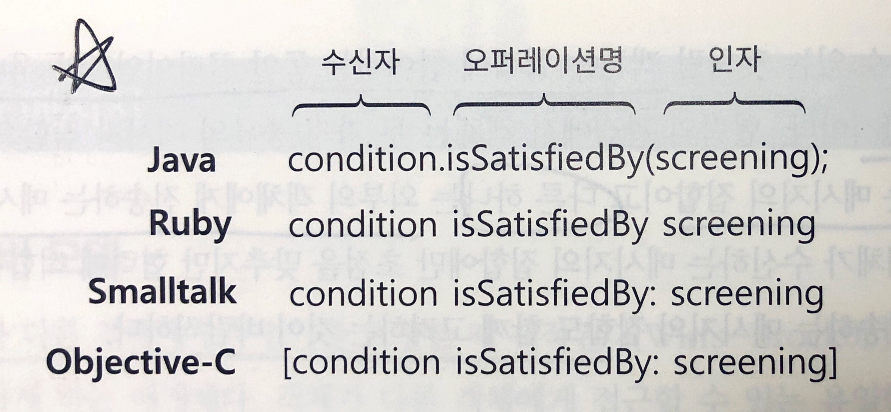
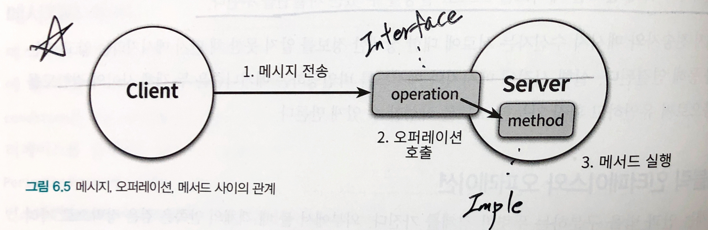

# 6. 메시지와 인터페이스
* 훌륭한 객체지향 코들르 얻기 위해서는 클래스가 아니라 **객체를 지향**해야 한다.
* 애플리케이션은 **클래스로 구성**되지만 **메시지를 통해 정의**된다.
* 객체가 수신하는 메시지들이 객체의 퍼블릭 인터페이스를 구성한다.

## 6.1 협력과 메시지
### 클라이언트-서버 모델
* 클라이언트-서버(Client-Server) 모델
  * 두 객체 사이의 협력 관계를 설명하기 위해 사용하는 전통적인 메타포.
    * 클라이언트 : 메시지를 **전송**하는 객체
    * 서버 : 메시지를 **수신**하는 객체
* 협력은 클라이언트가 서버의 서비스를 요청하는 **단방향** 상호작용.
* 객체가 다른 객체에게 접근할 수 있는 유일한 방법은 메시지를 전송하는 것뿐이다.
* 객체는 협력에 참여하는 동안 클라이언트와 서버의 역할을 동시에 수행하는 것이 일반적.
* 두 종류의 메시지 집합으로 구성
  * 객체가 수신하는 메시지의 집합
  * 외부의 객체에게 전송하는 메시지의 집합

### 메시지와 메시지 전송
* 메시지
  * 객체들이 협력하기 위해 사용할 수 있는 유일한 의사소통 수단.
* 한 객체가 다른 객체에게 도움을 요청하는 것
  * 메시지 전송(message sending) 또는 메시지 패싱(message passing)
* 메시지를 **전송**하는 객체 : 메시지 **전송**자(message sender) -> 클라이언트
* 메시지를 **수신**하는 객체 : 메시지 **수신**자(message receiver) -> 서버
* 메시지는 오퍼레이션명(operation name)과 인자(argument)로 구성되며 메시지 전송은 여기에 **메시지 수신자**를 추가한 것.
* 메시지 전송은 **메시지 수신자, 오퍼레이션명, 인자**의 조합.
  * 

### 메시지와 메서드
* 메서드
  * 메시지를 수신했을 때 실제로 수행되는 함수 또는 프로시저.
* 객체의 타입에 따라 실행되는 메서드가 달라질 수 있다.
* 메시지 전송자는 자신이 어떤 메시지를 전송해야 하는지만 알면 된다.
* 메시지 수신자는 누가 메시지를 전송하는지 알 필요가 없다.

### 퍼블릭 인터페이스와 오퍼레이션
* 퍼블릭 인터페이스
  * 객체가 의사소통을 위해 외부에 공개하는 메시지의 집합.
* 오퍼레이션
  * 퍼블릭 인터페이스에 포함된 메시지.
  * 수행 가능한 어떤 행동에 대한 **추상화**.
  * 실행하기 위해 객체가 호출될 수 있는 변환이나 정의에 관한 명세.
  * 인터페이스의 각 요소.
  * 구현이 아닌 추상화.
* 메서드
  * 메시지를 수신했을 때 실제로 실행되는 코드.
  * 오퍼레이션에 대한 구현.
  * 오퍼레이션과 연관된 알고리즘 또는 절차를 명시.
  * 

### 시그니처
* 시그니처
  * 오퍼레이션(또는 메서드)의 이름과 파라미터 목록을 합친 것.
  * 오퍼레이션은 실행 코드 없이 시그니처만을 정의한 것.
* 메서드는 시그니처에 구현을 더한 것.

#### 용어정리
* *메시지* : 객체가 다른 객체와 협력하기 위해 사용하는 의사소통 메카니즘.
* *오퍼레이션* : 객체가 다른 객체에게 제공하는 추상적인 서비스.
* *메서드* : 메시지에 응답하기 위해 실행되는 코드 블록.
* *퍼블릭* 인터페이스 : 객체가 협력에 참여하기 위해 외부에서 수신할 수 있는 메시지의 묶음. 클래스의 퍼블릭 메서드들.
* *시그니처* : 오퍼레이션이나 메서드의 명시. 이름과 인자의 목록을 포함.

### 6.2 인터페이스와 설계 품질
* 좋은 인터페이스는 **최소한의 인터페이스**와 **추상적인 인터페이스**라는 조건을 만족해야 한다.
  * 최소한의 인터페이스 : 꼭 필요한 오퍼레이션만을 인터페이스에 포함.
  * 추상적인 인터페이스 : 어떻게 수행하는지가 아니라 **무엇을 하는지**를 표현.
* 퍼블릭 인터페이스의 품질에 영향을 미치는 원칙과 기법
  * 디미터 법칙
    * 객체의 내부 구조에 대한 결합으로 인해 발생하는 문제를 해결하기 위해 제안된 원칙.
    * 캡슐화를 다른 관점에서 표현.
      * *캡슐화 원칙* : **클래스 내부의 구현을 감춰야 한다**는 사실을 강조.
      * *디미터 법칙* : 협력하는 클래스의 캡슐화를 지키기 위해 **접근해야 하는 요소를 제한**.
    * 디미터 법칙을 위반하는 코드의 모습
      * screening.getMovie().getDiscountConditions();
      * **기차 충돌(train wreck)**이라고 부르는데, 여러 대의 기차가 한 줄로 늘어서 충돌한 것처럼 보이기 때문.
    * 요약
      * 낯선 자에게 말하지 말라 (don't talk to strangers)
      * 오직 인접한 이웃하고만 말하라 (only talk to your immediate neighbors)
      * 오직 하나의 도트만 사용하라 (use only one dot)
    * **부끄럼타는 코드(shy code)** 작성 가능
      * 필요한 어떤 것도 다른 객체에게 보여주지 않음.
      * 다른 객체의 구현에 의존하지 않는 코드.
  * **묻지 말고 시켜라** (~~이름 좋다~~)
    * 훌륭한 메시지는 **객체의 상태에 관해 묻지 말고, 원하는 것을 시켜야 한다**는 사실을 강조.
    * 객체의 외부에서 해당 객체의 상태를 기반으로 결정을 내리는 것은 캡슐화 위반.
    * 객체의 정보를 이용하는 행동을 객체의 외부가 아닌 내부에 위치.
    * **묻지 말고 정보 전문가에게 책임을 할당**하여 높은 응집도를 구현하라.
    * **내부의 상태를 이용해 어떤 결정을 내리는 로직이 객체 외부에 존재하는가?**
      * 그렇다면 해당 객체가 책임져야 하는 어떤 행동이 객체 외부로 누수된 것이다.
  * 의도를 드러내는 인터페이스
    * 인터페이스 객체는 **어떻게 하는지**가 아니라 **무엇을 하는지**를 서술해야 한다.
    * 메서드 명명규칙 주의사항
      * 작업을 어떻게 수행하는지를 나타내지 말아야 함.
      * '어떻게'가 아니라 **'무엇'**을 하는지를 명시.
        * 어떻게 : 내부 구현 (isSatisfiedBy**Period**, isSatisfiedBy**Sequence**)
        * 무엇 : 책임 (isSatisfiedBy)
        * 이러한 명명규칙을 **의도를 드러내는 선택자(Intention Revealing Selector)**라고 부른다.
    * **방정식을 푸는 방법을 제시하지 말고 이를 공식으로 표현하라. 문제를 내라. 하지만 문제를 푸는 방법을 표현해서는 안 된다.**
  * 명령-쿼리 분리
    * 이것에 대한 설명은 없다?
